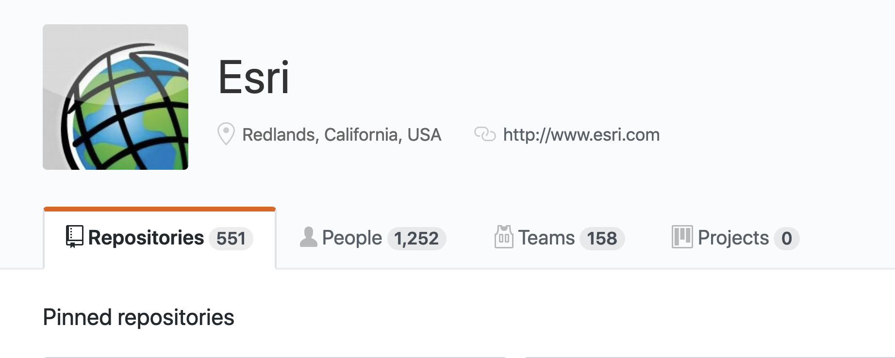

<!-- .slide: data-background="../common/slides/intro.jpg" -->
<!-- .slide: class="title" -->

<h1 style="text-align: left; font-size: 80px;">ArcGIS API for JavaScript Programming Patterns</h1>
<h2 style="text-align: left; font-size: 60px;">and API Fundamentals</h2>
<p style="text-align: left; font-size: 30px;">Kelly Hutchins| Rene Rubalcava</p>
    <p style="text-align: left; font-size: 30px;">slides: <a href="https://git.io/JvVml" target="_blank">https://git.io/JvVml</a></p>


----
<!-- .slide: data-background="./../common/slides/section.jpg" -->

# Kelly

----
<!-- .slide: data-background="./../common/slides/background.jpg" -->

## What do I get with the 4x JSAPI?

- Simplified and consistent API
- Write apps in ES6 or TypeScript
- Modern browser support (IE11+)
- [Supported in 30+ locales](http://www.arcgis.com/apps/3DInsetMap/index.html?locale=ja)

----

## Getting Started 

- App starters
- Widgets

[](https://github.com/search?o=desc&q=topic%3Ajavascript+org%3AEsri+fork%3Atrue&s=updated&type=Repositories)

----
<!-- .slide: data-background="./../common/slides/background.jpg" -->
## Widgets!
- We'll look at a few <a href="https://developers.arcgis.com/javascript/latest/sample-code/index.html?search=Widget">widgets</a>
- ~40 Widgets out of the box <!-- .element: class="fragment" data-fragment-index="1" -->
- Widgets help make great apps <!-- .element: class="fragment" data-fragment-index="2" -->
- Less code for you to write <!-- .element: class="fragment" data-fragment-index="3" -->
- Designed with responsive apps in mind <!-- .element: class="fragment" data-fragment-index="4" -->

----


## Widgets - Expand
 - [Clickable button to open container](https://codepen.io/kellyhutchins/pen/drOGNJ)
 - Icons
 - Group
 - Mode
  
<aside class="notes">Look at a few key widgets start with expand and point out common questions/gotchas </aside>

----

## Widgets - Portal Content

 - portalUrl (esri/config)
 - Theming, units, resources 

<iframe height="500" width="500" style="width: 100%;" scrolling="no" title="Portal demo" src="https://codepen.io/kellyhutchins/pen/rRoooz?theme-id=31222&default-tab=js,result" frameborder="no" allowtransparency="true" allowfullscreen="true">
  See the Pen <a href='https://codepen.io/kellyhutchins/pen/rRoooz'>Theme Testing</a> by Kelly Hutchins
  (<a href='https://codepen.io/kellyhutchins'>@kellyhutchins</a>) on <a href='https://codepen.io'>CodePen</a>.
</iframe>
<aside class="notes">Show how we can provide portal and widgets like search and bmg use that content.  </aside>

----


## Widgets - Popup 
 - Responsive
 - Dockable
 - Define fields, charts, custom html content

<a href="https://developers.arcgis.com/javascript/latest/sample-code/popuptemplate-arcade-groupby/index.html"></a>


----


### Widgets - Author popup content in Online 

<div style="max-width:50%;">
 - Web Map or Web Scene
 - Layer.fromPortalItem
</div>
<a href="https://codepen.io/kellyhutchins/pen/VwLQxqx" style="position:absolute;right:120px;top:120px;"></a>

----

## Widgets - Feature
 - Display popup template content
 - [Hover](https://developers.arcgis.com/javascript/latest/sample-code/sandbox/index.html?sample=widgets-feature)
 - [Sidepanel](https://developers.arcgis.com/javascript/latest/sample-code/widgets-feature-sidepanel/index.html)


<aside class="notes">Display popup content someplace else</aside>

----

## Widgets - Architecture

 View + View Model
 

<aside class="notes"> Separate business logic and presentation. Link to doc  </aside>

----

## Custom View 

  [Expand.tsx](https://developers.arcgis.com/javascript/latest/api-reference/esri-widgets-Expand.html)
  
<a href="https://github.com/Esri/attachment-viewer/blob/master/src/app/Components/MobileExpand.tsx#L555"></a>

----

## Use the View Model 

- Business logic and communication
  
<iframe height="500" width="500" style="width: 100%;" scrolling="no" title="Portal demo" src="https://codepen.io/odoe/embed/omqGMe?height=300&slug-hash=omqGMe&default-tabs=js,result&host=https://codepen.io#js-box" frameborder="no" allowtransparency="true" allowfullscreen="true">
  (<a href='https://codepen.io/odoe/embed/omqGMe'>Search on click</a>) on <a href='https://codepen.io'>CodePen</a>.
</iframe>

----


## Widgets - Styling
 Available Themes
<iframe height="500" width="500" style="width: 100%;" scrolling="no" title="Theme Testing" src="https://codepen.io/odoe/embed/preview/oNNGRbz?height=600&theme-id=39013&default-tab=js,result" frameborder="no" allowtransparency="true" allowfullscreen="true">
  See the Pen <a href='https://codepen.io/odoe/pen/oNNGRbz'>Theme Testing</a> by Rene Rubalcava
  (<a href='https://codepen.io/odoe'>@odoe</a>) on <a href='https://codepen.io'>CodePen</a>.
</iframe>

<aside class="notes">Look at ways to customize appearance of widgets</aside>
----

## Widgets - Styling
  Light and dark themes 
<iframe height="500" width="500" style="width: 100%;" scrolling="no" title="Theme Preferences" src="https://codepen.io/kellyhutchins/embed/QWbGGBv?height=600&theme-id=default&default-tab=html,result" frameborder="no" allowtransparency="true" allowfullscreen="true">
  See the Pen <a href='https://codepen.io/kellyhutchins/pen/QWbGGBv'>Theme Preferences</a> by Kelly Hutchins
  (<a href='https://codepen.io/kellyhutchins'>@kellyhutchins</a>) on <a href='https://codepen.io'>CodePen</a>.
</iframe>


----

## Widgets - Styling
 - Custom 
 - SASS
 - [Theme Utility](https://github.com/jcfranco/jsapi-styles)


<aside class="notes">Demo Franco's SASS utility (npm install and show code)</aside>

----

## Map and View
  - Maps manage references to layers and basemap 
  - Views 
    - Display layers
    - Handle interaction 
  - Map View 2D
  - Scene View 3D
  

----

## Map and View

```js
const map = new Map({
  basemap: "topo",
  layers: mapLayers // optional 
});

const mView = new MapView({
  map: map,
  container: "viewDiv"
});
const sView = new SceneView({
  map: map,
  container: "viewDiv"
});
```

----


## Multiple Views 

- Switch 2d to 3d
  - One map multiple views
  - Web map and Web scene 
  - <a href="https://developers.arcgis.com/javascript/latest/sample-code/views-switch-2d-3d/index.html">Limitations</a> 

- <a href="https://developers.arcgis.com/javascript/latest/sample-code/webmap-swap/index.html">Swap maps </a>
  
----


## Basemaps and Ground

- Convenience Strings

```js
const map = new Map({
  /*
   streets, satellite, hybrid, terrain, topo, gray,
   dark-gray, oceans, national-geographic, osm,
   dark-gray-vector, gray-vector, streets-vector, topo-vector,
   streets-night-vector, streets-relief-vector, streets-navigation-vector
   */
  basemap: "streets"

  /*
   world-elevation, world-topobathymetry 
   */
  ground: "world-elevation"
});
```

----

## Collections

- [`esri/core/Collection`](https://developers.arcgis.com/javascript/latest/api-reference/esri-core-Collection.html)
- Store items of same type
- Utility methods (filter, add, remove, forEach)
- Change event 
  
```ts
  view.map.layers.forEach((layer) => {
    console.log("Layer", layer.title);
  });
```

----
<!-- .slide: data-background="./../common/slides/section.jpg" -->

# Rene

----

## Working with Accessor

- Objects are have properties that can be:
  - read and set
  - or read-only
  - constructor arguments
  - watchable

----

### Accessor - property access

```ts
layer.opacity = 0.5;
layer.title = "My test layer";

// setting multiple values
layer.set({
  opacity: 0.5,
  title: "My test layer"
});

// accessing the value of a deep property
view.get("map.basemap.title");
view.set("map.basemap.title", "new title");
```

----

### Accessor - property watching

```ts
mapView.watch("scale", (newValue, oldValue, property, target) => {
  console.log(`scale changed: ${newValue}`);
});


mapView.watch("map.basemap.title", (newValue, oldValue, property, target) => {
  console.log(`new basemap title: ${newValue}`);
});


mapView.watch("ready, stationary", (newValue, oldValue, property, target) => {
  console.log(`property ${property}: ${newValue}`);
});

watchUtils.whenTrue(view, "stationary", () => {
  console.log("view is stationary");
})
```

[watchUtils](https://developers.arcgis.com/javascript/latest/api-reference/esri-core-watchUtils.html)

----

### Accessor - autocasting and single constructor

```js
  {
    // autocast as new SimpleMarkerSymbol()
    type: "simple-marker",
    style: 'square',
    color: 'red',
    size: 10,
    outline: {
      color: 'rgba(255, 255, 255, 0.5)'
      width: 4
    }
  });
```

----
<!-- .slide: data-background="./../common/slides/section.jpg" -->

## Promises


[mdn](https://developer.mozilla.org/en-US/docs/Web/JavaScript/Reference/Global_Objects/Promise)

----

## Promises

- All asynchronous methods return a promise, no more [events](https://developers.arcgis.com/javascript/jsapi/querytask-amd.html#events)
- The basic pattern looks like this:

```js
layer.queryFeatures(query).then(handleResult).catch(handleError);
```

----

### Notes

> No more Dojo Promise, fully native Promise.

> No more promise.cancel()

> Use [AbortSignal](https://developer.mozilla.org/en-US/docs/Web/API/AbortSignal) if you need to cancel a Promise

----

## Promises with async/await

```js
const doQuery = async (query) => {
  const results = await layer.queryFeatures(query);
  const transformedResults = results.map(transformData);
  return transformedResults;
}
```

----

## Promises

- Load resources
- Asychronously initialized `Layer`, `WebMap`, `WebScene`, `View`

```js
const map = new Map({...})

view = new SceneView({
  map: map,
  //...
});

view.when(() => {
  // the view is ready to go
});
```

----

## Promises

```js
view.when(() => {
  return view.whenLayerView(map.findLayerById("awesomeLayer"));
})
.then(layerView => {
  return watchUtils.whenFalseOnce(layerView, "updating");
})
.then(result => {
  const layerView = result.target;
  return layerView.queryFeatures();
})
.then(doSomethingWithFeatures)
.catch(errorHandler);
```

[API sample](https://developers.arcgis.com/javascript/latest/sample-code/chaining-promises/index.html)

----

## async/await

```js
const init = async (doSomethingWithFeatures) => {
  await view.when();
  const layerView = await view.whenLayerView(map.findLayerById("awesomeLayer"));
  const { target as layerView } = await watchUtils.whenFalseOnce(layerView, "updating");
  const features = await layerView.queryFeatures();
  doSomethingWithFeatures(features);
};

try {
  init();
}
catch(error) {
  errorHandler(error);
}

```

* <a href="https://codepen.io/odoe/pen/jOPZgwo?editors=0011" rel=”noreferrer” target="_blank">Demo</a>

----

## Abort Signal

```js
async function requestsMadness(urls, abortSignal) {
  const promises = urls.map(url => request(url, { signal: abortSignal });
  // Resolves all Promises, even if rejected
  const results = await promiseUtils.eachAlways(promises);
  if (abortSignal && abortSignal.aborted) {
    // user should get a reject
    throw promiseUtils.createAbortError();
  }
  return results;
}
const controller = new AbortController();
const signal = controller.signal;

requestsMadness(urls, signal);
// somewhere in code
controller.abort();
```

----

### Where can I use AbortSignal?

* [esri/request](https://developers.arcgis.com/javascript/latest/api-reference/esri-request.html#methods-summary)
* [queryFeatures()](https://developers.arcgis.com/javascript/latest/api-reference/esri-layers-FeatureLayer.html#queryFeatures)
* Other query tasks

----
<!-- .slide: data-background="./../common/slides/section.jpg" -->


## Patterns

----

## Interactivity with view events

- Use view events to interact with the view
- [List of events](https://developers.arcgis.com/javascript/latest/api-reference/esri-views-MapView.html#events-summary)
- You can stop the propagation of the event to prevent the default behavior

```js
view.on("drag", event => {
  // user won't be able to drag
  event.stopPropagation();
})
```

----

## Interactivity with view events

- Access the features on click

```js
view.on("click", ({ x, y }) => {
  const screenPoint = {x, y};
  view.hitTest(screenPoint)
    .then(response => {
       // do something with the result graphic
       const graphic = response.results[0].graphic;
    });
});
```
- [API Sample](https://developers.arcgis.com/javascript/latest/sample-code/sandbox/index.html?sample=view-hittest)

----

## goTo() with View

- Sets the view to a given target.
  - Navigate to a geometry/feature/location
- [API Sample](https://developers.arcgis.com/javascript/latest/sample-code/sandbox/index.html?sample=scene-goto)

----

## Loadables

- brings better control, and scheduling of loading resources.
- extension of `esri/core/Promise`
- in 3.x, instanciating a layer loads it. in 4.0, it's an explicit call
- the views automatically loads the map and its layers

----

## Loadables

- `WebMap` / `WebScene` need to load:
 - the portal item
 - the layer module
 - the layer's item
- `MapView` / `SceneView` need to load:
 - the map
 - the layers

----

## Loadables

```js
  //In a single page application, get a feature from a FeatureLayer from a WebMap without displaying it, ASAP!
  const webmap = new WebMap({
    portalItem: {
      id: 'affa021c51944b5694132b2d61fe1057'
    }
  });

  webmap.load()
    .then(() => {
      return webmap.getLayer('myFeatureLayerId').load();
    })
    .then(featureLayer => {
      return featureLayer.queryFeatures({
        where: 'OBJECTID = 1'
      });
    })
    .then(result => {
      displayDetails(result.features[0]);
    })
    .otherwise(error => {
      console.error(error);
    });
```

----

## Zoom or Scale


----

## Zoom or Scale

```js
const view = new MapView({
  container: "viewDiv",
  map: map,
  center: [-116.5, 33.80],
  zoom: 14 // what does that really mean?
});
```

- Zoom = LOD (Level of Details)
- Not all LODs are created equal

----

## Zoom is not Scale

```js
const view = new MapView({
  container: "viewDiv",
  map: map,
  center: [-116.5, 33.80],
  scale: 50000 // I know what that means!
});
```

- Scale is portable
- Scale has meaning
- We still snap to closest LOD/zoom

----

## Zoom or Scale

<iframe height="500" style="width: 100%;" scrolling="no" title="Zoom and Scale" src="https://codepen.io/odoe/embed/preview/NWqazra?height=500&theme-id=39013&default-tab=js,result&editable=true" frameborder="no" allowtransparency="true" allowfullscreen="true">
  See the Pen <a href='https://codepen.io/odoe/pen/NWqazra'>Zoom and Scale</a> by Rene Rubalcava
  (<a href='https://codepen.io/odoe'>@odoe</a>) on <a href='https://codepen.io'>CodePen</a>.
</iframe>

----

## Sublayer to FeatureLayer

- You can extract a FeatureLayer from MapImageLayer Sublayer
- `sublayer.createFeatureLayer()` returns a _Promise_
- Can use capabilities not normally available with Sublayer

----

## Sublayer to FeatureLayer

<iframe height="500" style="width: 100%;" scrolling="no" title="createFeatureLayer" src="https://codepen.io/odoe/embed/preview/PaxeyO?height=500&theme-id=39013&default-tab=js,result" frameborder="no" allowtransparency="true" allowfullscreen="true">
  See the Pen <a href='https://codepen.io/odoe/pen/PaxeyO'>createFeatureLayer</a> by Rene Rubalcava
  (<a href='https://codepen.io/odoe'>@odoe</a>) on <a href='https://codepen.io'>CodePen</a>.
</iframe>

----

## createQuery

- When you can do `layer.createQuery()`
  - `query` object will already have the layers filters and layer definitions
  - more consistent
- Use `new Query()` when you don't want predefined filters to be applied

----

## createQuery

<iframe height='500' scrolling='no' title='createQuery' src='//codepen.io/odoe/embed/preview/rKQqQW/?height=500&theme-id=39013&default-tab=js,result&embed-version=2' frameborder='no' allowtransparency='true' allowfullscreen='true' style='width: 100%;'>See the Pen <a href='https://codepen.io/odoe/pen/rKQqQW/'>createQuery</a> by Rene Rubalcava (<a href='https://codepen.io/odoe'>@odoe</a>) on <a href='https://codepen.io'>CodePen</a>.
</iframe>

----

## MapImageLayer

- If you want to modify Sublayers, do it after you load the layer
- Defining them upfront overrides the defaults
  - May not be what you want

----

## MapImageLayer

<iframe height='500' scrolling='no' title='MapImageLayer - Load Sublayers' src='//codepen.io/odoe/embed/preview/WyYBwL/?height=500&theme-id=39013&default-tab=js,result&embed-version=2' frameborder='no' allowtransparency='true' allowfullscreen='true' style='width: 100%;'>See the Pen <a href='https://codepen.io/odoe/pen/WyYBwL/'>MapImageLayer - Load Sublayers</a> by Rene Rubalcava (<a href='https://codepen.io/odoe'>@odoe</a>) on <a href='https://codepen.io'>CodePen</a>.
</iframe>

----

## LayerViews

- Renders the Layer
- When is it done though?
  - _hotly debated topic!_
  - When can you actually use it!!
  - Behavior different with optimized FeatureLayer

----

## LayerViews

<iframe height="500" style="width: 100%;" scrolling="no" title="LayerView - When Things are Done" src="https://codepen.io/odoe/embed/preview/gOpadzL?height=500&theme-id=39013&default-tab=js,result" frameborder="no" allowtransparency="true" allowfullscreen="true">
  See the Pen <a href='https://codepen.io/odoe/pen/gOpadzL'>LayerView - When Things are Done</a> by Rene Rubalcava
  (<a href='https://codepen.io/odoe'>@odoe</a>) on <a href='https://codepen.io'>CodePen</a>.
</iframe>

----


