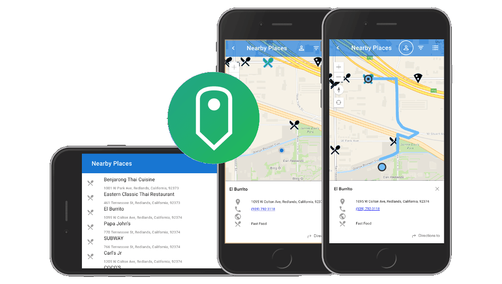

<!-- .slide: data-background="../common/slides/intro.jpg" -->
<!-- .slide: class="title" -->

<h1 style="text-align: left; font-size: 80px;">ArcGIS API for JavaScript</h1>
<h2 style="text-align: left; font-size: 60px;">Using Frameworks</h2>
<p style="text-align: left; font-size: 30px;">Andy Gup, Gavin Rehkemper, Tom Wayson, Rene Rubalcava</p>
    <p style="text-align: left; font-size: 30px;">slides: <a href="https://git.io/JvVtP" target="_blank">https://git.io/JvVtP</a></p>

<!--
Do you have a framework of choice for building apps? Learn how to use various frameworks like Angular, Ember, React, and Vue with the ArcGIS API for JavaScript to build scalable applications your way. We’ll look at how you can integrate these frameworks to build powerful mapping applications.
-->

----

## [ArcGIS API Framework Guides](https://developers.arcgis.com/javascript/latest/guide/using-frameworks/)

<a href="https://developers.arcgis.com/javascript/latest/guide/using-frameworks/"></a>

----

## ArcGIS

1. <!-- .element: class="fragment" --> `Map`
  - `basemap`, `portalItem`, ...
1. <!-- .element: class="fragment" --> `View`
  - `map`
  - `container`
  - ...

----

## Framework

1. <!-- .element: class="fragment" --> global state
  - router
  - store
1. <!-- .element: class="fragment" --> `render(<App>, '#root')`
  - <!-- .element: style="list-style: none" -->  `<Layout>`
    - <!-- .element: style="list-style: none" --> `<Parent>`
      - <!-- .element: style="list-style: none" --> `<Child>`

----

## Component as bridge

<div style="display: flex; flex-direction: row; justify-content: space-between">
  <div>
    <p><strong>Framework</strong></p>
    <ul style="list-style: none;">
      <li>`<App />`</li>
      <li>&nbsp;&nbsp;`<Layout>`</li>
      <li>&nbsp;&nbsp;&nbsp;&nbsp;`<Parent>`</li>
    </ul>
  </div>
  <div>
    <p>&nbsp;</p>
    <p>&nbsp;</p>
    <p>&nbsp;</p>
    <p style="margin-bottom: 0; font-size: .7em" class="fragment" data-fragment-index="1">-> state -> render -> DOM -></p>
    <p style="margin: 0">`<MapComponent />`</p>
    <p style="margin-top: 0; font-size: .7em" class="fragment" data-fragment-index="3"><- state <- callback <- handler <-</p>
  </div>
  <div>
    <strong>ArcGIS</strong>
    <p>&nbsp;</p>
    <p>&nbsp;</p>
    <div class="fragment" data-fragment-index="2">
      <p>`new Map()`</p>
      <p>`new View()`</p>
    </div>
  </div>
</div>

----

## Component Lifecycle

3 important phases:
1. <!-- .element class="fragment" data-fragment-index="1" --> after initial render <br>`this.view = new View()`
1. <!-- .element class="fragment" data-fragment-index="3" --> update <br>`this.view.zoom = this.zoom`
1. <!-- .element class="fragment" data-fragment-index="2" --> before destroy <br>`this.view.container = null`

----
<!-- .slide: data-background="./../common/slides/section.jpg" -->

## Loading the ArcGIS API

Install with `npm` or `yarn`, then:

```js
import Map from 'esri/Map';
import MapView from 'esri/views/MapView';
```

right? <!-- .element class="fragment" -->

----

### 😎 [@arcgis/webpack-plugin](https://github.com/Esri/arcgis-webpack-plugin) 👍
<p>... but</p>
<p class="fragment">Must be using webpack 🙄</p>
<p class="fragment">ArcGIS API 4.7+ only</p>
<p class="fragment">Must be able to configure webpack</p>

----

<!-- .slide: data-transition="fade" -->
<p>👵 ArcGIS API 3.x? 👴</p>
<p>🚀 CLI blocks access to webpack config? 🔒</p>
<p>🙈 Don't _want_ to config webpack? 😱</p>
<div class="fragment">
  <p>No problem. Try [esri-loader](https://github.com/Esri/esri-loader)</p>
  
</div>

----

<!-- .slide: data-transition="fade" -->
### Works with ArcGIS API [3.x](https://developers.arcgis.com/javascript/3/) <span class="fragment" data-fragment-index="1">_and_ 4.x</span>

<div>
  
  
  
  
</div>

----

<!-- .slide: data-transition="fade" -->
### Works with _any_ module loader

<div>
  
  
  
  
  
</div>

----

<!-- .slide: data-transition="fade" -->
### Works with _any_ framework

<div>
  
  
  
  
  
  
  
</div>

----

<!-- .slide: data-transition="fade" -->
### Installing [esri-loader](https://github.com/Esri/esri-loader#install)


<h3><code>npm install --save esri-loader</code></h3>

----

<!-- .slide: data-transition="fade" -->
### Installing [esri-loader](https://github.com/Esri/esri-loader#install)


<h3><code>yarn add esri-loader</code></h3>

----

<!-- .slide: data-transition="fade" -->
### Using [`loadModules()`](https://github.com/Esri/esri-loader#usage)

```js
import { loadModules } from 'esri-loader';

loadModules([
  "esri/Map",
  "esri/views/MapView"
]).then(([Map, MapView]) => {
  // Code to create the map and view will go here
});
```

----
<!-- .slide: data-background="./../common/slides/section.jpg" -->

## _Lazy_ Loading the ArcGIS API



----

### esri-loader

<pre class="language-js">
<code class="language-js">
 // loads API 1st time
const esriConfig = await loadModules(["esri/config"])
esriConfig.useIdentity = false;
// don't worry, this won't load the API again!
const [Map, MapView] = await loadModules(
  ["esri/Map", "esri/views/MapView"]
);</code></pre>

[Lazy loads the ArcGIS API](https://github.com/Esri/esri-loader#lazy-loading-the-arcgis-api-for-javascript) by default

----

### @arcgis/webpack-plugin

```ts
async function loadMap (element) => {
  const mapUtils = await import("../utils/map");
  mapUtils.loadMap(element);
};

  // then later inside the mounted/init...
  loadMap(element);
```

Use [dynamic `import()`](https://webpack.js.org/guides/code-splitting/#dynamic-imports)
