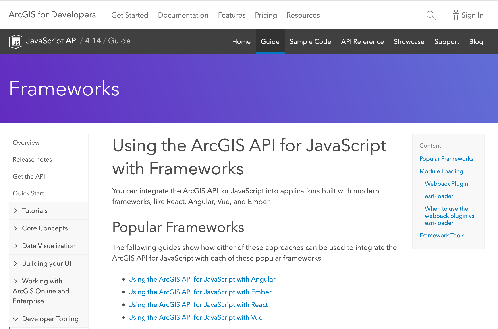

<!-- .slide: data-background="../common/slides/intro.jpg" -->
<!-- .slide: class="title" -->

<h1 style="text-align: left; font-size: 80px;">ArcGIS API for JavaScript</h1>
<h2 style="text-align: left; font-size: 60px;">Using Frameworks</h2>
<p style="text-align: left; font-size: 30px;">Andy Gup, Gavin Rehkemper, Tom Wayson, Rene Rubalcava</p>
    <p style="text-align: left; font-size: 30px;">slides: <a href="https://git.io/Je0yM" target="_blank">https://git.io/Je0yM</a></p>

<!--
Do you have a framework of choice for building apps? Learn how to use various frameworks like Angular, Ember, React, and Vue with the ArcGIS API for JavaScript to build scalable applications your way. We’ll look at how you can integrate these frameworks to build powerful mapping applications.
-->

----

## ArcGIS API Framework Guides

<a href="https://developers.arcgis.com/javascript/latest/guide/using-frameworks/"></a>


----
<!-- .slide: data-background="./../common/slides/section.jpg" -->

## Loading the ArcGIS API

```js
import Map from 'esri/Map';
import MapView from 'esri/views/MapView';
// then later inside the mounted/init...
const map = new Map({
    basemap: "streets-navigation-vector"
});
const view = new MapView({
    container: element,
    map,
    center: [-118.174, 34.024],
    zoom: 12
});
```

----

### 😎 [@arcgis/webpack-plugin](https://github.com/Esri/arcgis-webpack-plugin) 👍
<p class="fragment">... but</p>
<p class="fragment">Must be using webpack 🙄</p>
<p class="fragment">ArcGIS API 4.7+ only</p>
<p class="fragment">Must be able to configure webpack</p>

----

<!-- .slide: data-transition="fade" -->
<p>👵 ArcGIS API < 4.7x? 👴</p>
<p>🚀 CLI blocks access to webpack config? 🔒</p>
<p>🙈 Don't _want_ to config webpack? 😱</p>

----

<!-- .slide: data-transition="fade" -->
###  No problem. Try [esri-loader](https://github.com/Esri/esri-loader)

<div>
    
</div>


----

<!-- .slide: data-transition="fade" -->
### Works with ArcGIS API [3.x](https://developers.arcgis.com/javascript/3/) <span class="fragment" data-fragment-index="1">_and_ 4.x</span>

<div>
  
  
  
  
</div>

----

<!-- .slide: data-transition="fade" -->
### Works with _any_ module loader

<div>
  
  
  
  
  
</div>

----

<!-- .slide: data-transition="fade" -->
### Works with _any_ framework

<div>
  
  
  
  
  
  
  
</div>

----

<!-- .slide: data-transition="fade" -->
### Installing [esri-loader](https://github.com/Esri/esri-loader#install)


<h3><code>npm install --save esri-loader</code></h3>

----

<!-- .slide: data-transition="fade" -->
### Installing [esri-loader](https://github.com/Esri/esri-loader#install)


<h3><code>yarn add esri-loader</code></h3>

----

<!-- .slide: data-transition="fade" -->
### Using [`loadModules()`](https://github.com/Esri/esri-loader#usage)

```js
import { loadModules } from 'esri-loader';

loadModules([
  "esri/Map",
  "esri/views/MapView"
]).then(([Map, MapView]) => {
  // Code to create the map and view will go here
});
```
