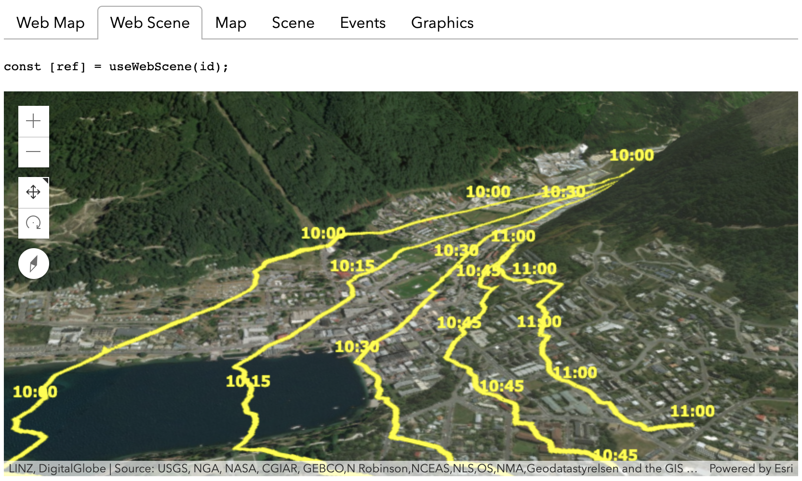

<!-- .slide: data-background="./../common/slides/section.jpg" -->

## React


<p><code>ui = f(s)</code></p>

----

<iframe src="https://developers.arcgis.com/javascript/latest/guide/react/#react-class" style="width: 600px; height:  600px"></iframe>

[Using the ArcGIS API for JavaScript with React](https://developers.arcgis.com/javascript/latest/guide/react)

----

### Use a [ref](https://reactjs.org/docs/refs-and-the-dom.html) for the `container`

```js
  constructor(props) {
    super(props);
    this.mapRef = React.createRef();
  }

  render() {
    return (
      <div className="webmap" ref={this.mapRef} />
    );
  }
```

----

### Create `Map` and `View` in [`componentDidMount()`](https://reactjs.org/docs/react-component.html#componentdidmount)

```js
  componentDidMount() {
    const map = new ArcGISMap({
      basemap: 'topo-vector'
    });
    this.view = new MapView({
      container: this.mapRef.current,
      map: map,
      center: [-118, 34],
      zoom: 8
    });
  }
```

----

### Clean up in [`componentWillUnmount()`](https://reactjs.org/docs/react-component.html#componentwillunmount)

```js
  componentWillUnmount() {
    if (this.view) {
      // destroy the map view
      this.view.container = null;
    }
  }
```

----

### Function Components

`const NameTag = (props) => { <p>{props.name}</p> }`

`<NameTag name="Tom" />`<!-- .element class="fragment" -->

<ul class="fragment">
  <li>no state
  <li>no way to create refs
  <li>no access to lifecycle methods
</ul>

----

### React Hooks

<iframe src="https://developers.arcgis.com/javascript/latest/guide/react/#react-hooks" style="width: 600px; height:  600px"></iframe>

----

### [esri-loader-hooks](https://github.com/tomwayson/esri-loader-hooks#usewebmap)

```jsx
import React from 'react';
import { useWebMap } from 'esri-loader-hooks';

function WebMap() {
  const [ref] = useWebMap('e691172598f04ea8881cd2a4adaa45ba');
  return <div style={{ height: 400 }} ref={ref} />;
}
```

----

### Demo: [esri-loader-hooks](https://esri-loader-hooks.netlify.com/)

<a href="https://esri-loader-hooks.netlify.com/"></a>

