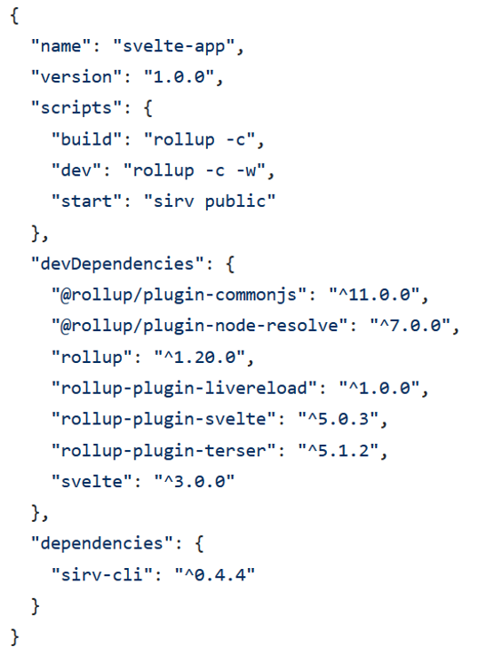
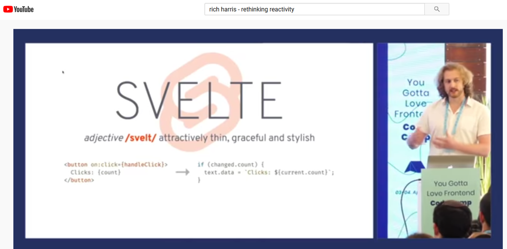
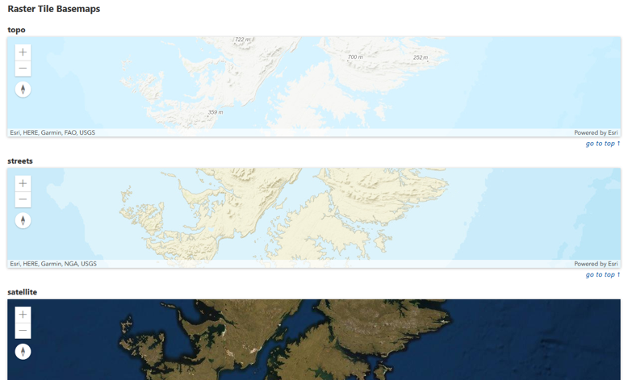

<!-- .slide: data-background="./../common/slides/section.jpg" -->

# Gavin

----
<!-- .slide: data-background="./../common/slides/section.jpg" -->

  

  

    <h2>Svelte</h2>
    https://svelte.dev
  

----

## What is Svelte?

- Component Framework
- Reactive (like React or Vue)
- Compiler - Svelte runs at build time

----

https://github.com/sveltejs/template/blob/master/package.json

----
### Rich Harris – Rethinking Reactivity (YouTube)

----
## Getting Started with Svelte

- Dynamic Attributes
- Nested Components
- Reactivity

----

## ArcGIS API for JavaScript Maps in Svelte

- Use esri-loader:
  - Add it to rollup.config.js
  - Import and use as usual (see github.com/Esri/esri-loader)
- Example: github.com/gavinr/esri-svelte-example

----

## Map in a Svelte Component

https://github.com/jwasilgeo/esri-svelte-basemaps-example

----

## Bonus: Sapper!

  

  

    
  

----
<!-- .slide: data-background="./../common/slides/section.jpg" -->

  

  

    <h2>Svelte</h2>
    https://svelte.dev
  

