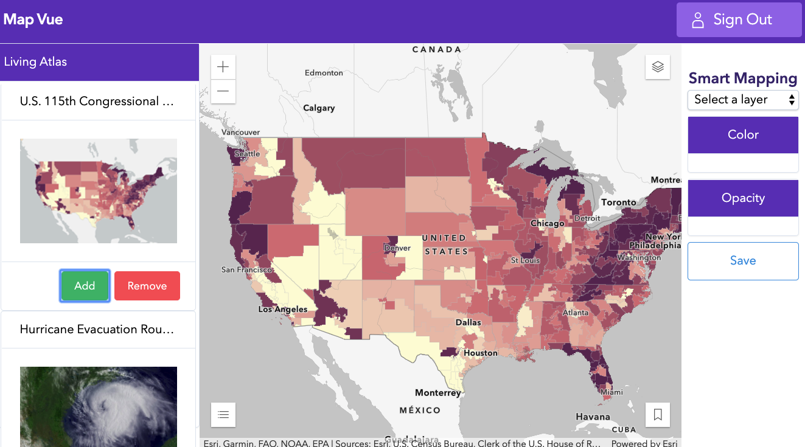

<!-- .slide: data-background="./../common/slides/section.jpg" -->

## Vue


----

### Can use the CLI

```sh
arcgis create geo-vue -t vue
```

----

### Can use vue-cli

* Requires a little config
* [Working user repo](https://github.com/crackernutter/arcgis-webpack-vue-calcite)

----

### Add a Map

```tsx
export default {
    name: 'WebMap',
    async mounted() {
        // Load the API modules
        const { default: WebMap } = await import('esri/WebMap');
        const { default: MapView } = await import('esri/views/MapView');
        const view = new MapView({
          map: new WebMap({ ... }),
          container: this.$el
        });
    }
};
```

----

### State Management

* [Vuex](https://vuex.vuejs.org/)


----

### State Management

* [XState](https://xstate.js.org/)


----
<!-- .slide: data-background="./../common/slides/demo.jpg" -->

### Vue Demo

<a href="https://jsapi-map-vue.surge.sh/" target="_blank" rel="noopener">
  
</a>
