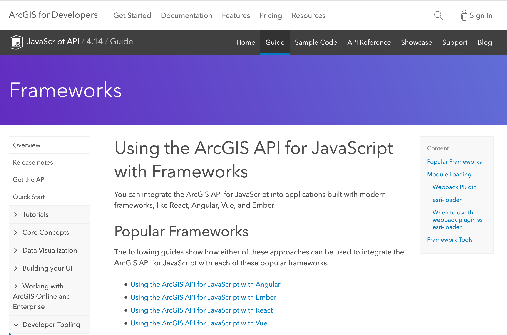
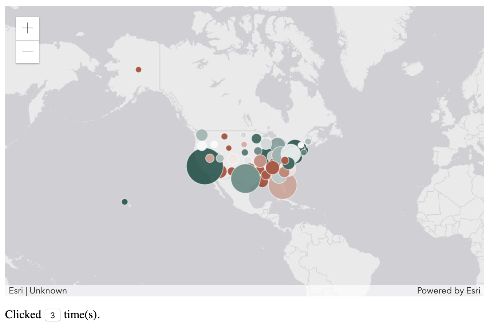
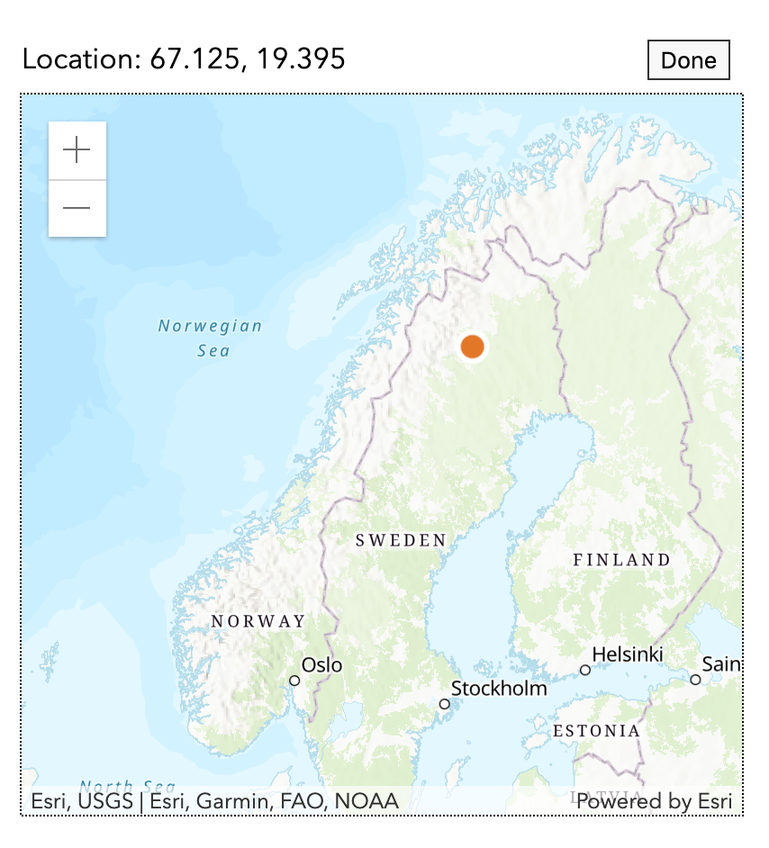
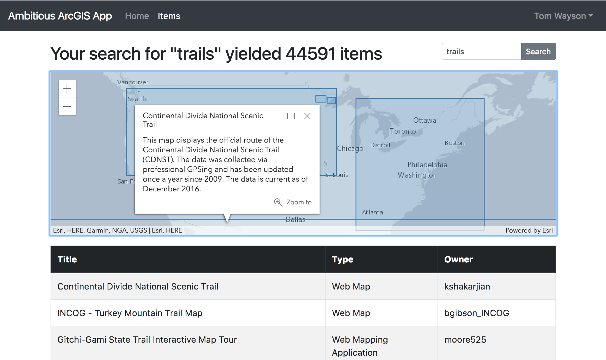

<!-- .slide: data-background="../common/slides/intro.jpg" -->
<!-- .slide: class="title" -->

<h1 style="text-align: left; font-size: 80px;">ArcGIS API for JavaScript</h1>
<h2 style="text-align: left; font-size: 60px;">Using Webpack and React</h2>
<p style="text-align: left; font-size: 30px;">Tom Wayson, Rene Rubalcava</p>
    <p style="text-align: left; font-size: 30px;">slides: <a href="https://git.io/JvVmR" target="_blank">https://git.io/JvVmR</a></p>

<!--
Learn to build powerful applications that integrate the ArcGIS API for JavaScript via the ArcGIS webpack plugin or esri-loader. In this session, we’ll use React to build a fast and responsive application that uses modern tooling and techniques.
-->

----

## ArcGIS API Framework Guides

<a href="https://developers.arcgis.com/javascript/latest/guide/using-frameworks/"></a>


----
<!-- .slide: data-background="./../common/slides/section.jpg" -->

## React

<p><code>ui = f(s)</code></p>

----
<!-- .slide: data-background="./../common/slides/background.jpg" -->

## ArcGIS API for JavaScript

`🌎 = new F(id, container)`

----

<!-- .slide: data-background="../common/images/ReactArcGISVennDiagram.svg" -->


----

<!-- .slide: data-background="../common/images/ReactArcGISVennDiagram2.svg" -->

----

<!-- .slide: data-background="../common/images/ReactArcGISVennDiagram3.svg" -->

----

<!-- .slide: data-background="../common/images/ReactMapAppLight.svg" -->

----

<!-- .slide: data-background="../common/images/ReactMapAppDark.svg" -->

----

<!-- .slide: data-background="../common/images/ReactMapAppDarkComponents.svg" -->

----

<!-- .slide: data-background="../common/images/ReactMapAppDarkArcGISCode.svg" -->

----

<!-- .slide: data-background="../common/slides/background.jpg" class="code-md" data-transition="fade" -->
### Class-based component

```jsx
render() {
  return <div ref={this.mapDiv} />;
}
componentDidMount() {
  this._view = createMapView(this.mapDiv.current, this.props.id);
}
componentWillUnmount() {
  !!this._view && this._view.destroy();
}
```

----

## What the hook?

Write stateful components using functions instead of classes

----

### React hooks

* `useRef`
* `useEffect`
* `useState`

and [more](https://reactjs.org/docs/hooks-intro.html)!

----

<!-- .slide: data-background="../common/slides/background.jpg" class="code-md" data-transition="fade"-->

### `useRef`

Get a reference to a DOM node...

```ts
const elRef = useRef(null);
// later
const container = elRef.current
```

<small class="fragment">
  ...or _anything_ else that changes outside of React state (view, prev prop values)
</small>

----

<!-- .slide: data-background="../common/slides/background.jpg" class="code-md" data-transition="fade"-->

### `useState`

* Manage local state
* Keep it simple

```ts
const [ready, setReady] = useState(false);
// later
setReady(true);
```

----

### `useEffect`

* Replaces some class lifecycle methods... mostly
  * `componentDidMount`
  * `componentDidUpdate`
  * `componentWillUnmount`

----

### Demo: hooks web map component

<a href="https://developers.arcgis.com/javascript/latest/guide/react/"></a>

----

<!-- .slide: data-background="../common/slides/background.jpg" class="code-md" data-transition="fade"-->

### 🎉 Success! 🎉

<p class="fragment">✅ created a map using a ref to React generated DOM</p>
<p class="fragment">✅ only destroy `MapView` when unmounting</p>

----

<!-- .slide: data-background="../common/slides/section.jpg" class="code-md" data-transition="fade"-->
### 🤔 Relay state changes between component and view?

----

<!-- .slide: data-background="img/wayson/React Component and ArcGIS Widget lifecycle-3.png" -->

----

<!-- .slide: data-background="img/wayson/React Component and ArcGIS Widget lifecycle-4.png" -->

----

<!-- .slide: data-background="img/wayson/React Component and ArcGIS Widget lifecycle-5.png" -->

----

<!-- .slide: data-background="../common/slides/section.jpg"-->

## Demo: Location picker



----

<!-- .slide: data-background="../common/slides/background.jpg" -->

### Components that wrap views or widgets

<small class="fragment">... class-based or hooks 🙂</small>

<ul>
  <li class="fragment">✅ use a `ref` to access the DOM node</li>
  <li class="fragment">✅ pass parent `state` & `callbacks` to map component via `props`</li>
  <li class="fragment">✅ use clean-up functions to remove event & watch handlers</li>
  <li class="fragment">✅ be careful not to destroy the view until unmounting</li>
</li>


----

<!-- .slide: data-background="../common/slides/section.jpg" -->
## Modern React and the ArcGIS API

----

### Manage global state in React

* You may not need Redux/MobX
* Context is powerful, and injectable

----

<!-- .slide: data-background="../common/slides/section.jpg" -->

### `useContext` hook

```jsx
import ThemeContext from '.ThemeContext';

const ThemedMap = () => {
  const theme = useContext(ThemeContext);
  const basemap = theme === 'dark'
    ? 'dark-gray'
    : 'gray';
  return (
    <Map basemap={basemap} />
  );
};
```

----

<!-- .slide: data-background="../common/slides/section.jpg" -->

## Modularize API usage

----

* Do all the API work separate from your UI
* _Separate content from navigation_ - pattern in PWAs
* Mock/stub API in tests

```ts
// src/data/map.ts
export function initialize(element: Element) {
  view.container = element;
  view.when(() => {
    // magic
  });
}
```

----

* Use in your context or component

```ts
const elRef = useRef(null);
useEffect(
  () => {
    const loadMap = async (container) => {
      const map = await import("../data/map");
      map.initialize(elRef.current);
    };
    loadMap();
  },
  []
);
```

----

<!-- .slide: data-background="../common/slides/section.jpg" -->

## Why lazy load the API?

* So webpack can create async bundles
* `bundle1.js` -> `bundle2.js` -> `bundle3.js`
* Only load the resources you need when you need them
* Leads to faster initial loads

----

<!-- .slide: data-background="../common/slides/background.jpg" -->

## Suspense

----

## Hold your Suspense

* Lazy-load entire React components
* useful in modular apps

```tsx
import React, { lazy, Suspense } from "react";
// lazy load the components that use Maps
const WebMapView = lazy(() => import("../components/WebMapView"));
// later on
<Suspense  fallback={<div>Loading...</div>}>
  <WebMapView />
</Suspense>
```

----
<!-- .slide: data-background="../common/slides/demo.jpg" -->

## Demo: Location picker w/ lazy load


----

<!-- .slide: data-background="../common/slides/demo.jpg" -->

##  Example: [Nearby JavaScript](https://developers.arcgis.com/example-apps/nearby-javascript/)


----

<!-- .slide: data-background="../common/slides/section.jpg" data-transition="fade" -->

## 😎 [@arcgis/webpack-plugin](https://github.com/Esri/arcgis-webpack-plugin) 👍
<p class="fragment">... but</p>
<p class="fragment">ArcGIS API 4.7+ only</p>
<p class="fragment">Must be able to configure webpack</p>


----

<!-- .slide: data-background="../common/slides/demo.jpg" data-transition="fade" -->

## Popular React Tools & Frameworks

<table class="clis">
  <tbody>
    <tr>
      <td>
        <a href="https://github.com/facebook/create-react-app">
          
          <p>create-react-app</p>
        </a>
      </td>
      <td>
        <a href="https://nextjs.org/">
          
          <p>Next.js</p>
        </a>
      </td>
      <td>
        <a href="https://www.gatsbyjs.org/">
          
          <p>Gatsby</p>
        </a>
      </td>
    </tr>
  </tbody>
</table>
<p class="fragment">All insulate you from 😱 of webpack config</p>

----

<!-- .slide: data-transition="fade" -->
<p>👵 ArcGIS API < 4.7x? 👴</p>
<p class="fragment">🔒 No access to webpack config? 🔒</p>
<p class="fragment">🙈 Don't _want_ to config webpack? 😱</p>

----

<!-- .slide: data-transition="fade" -->
###  No problem. Try [esri-loader](https://github.com/Esri/esri-loader)

<div>
    
</div>

----

<!-- .slide: data-transition="fade" -->
### Works with ArcGIS API [3.x](https://developers.arcgis.com/javascript/3/) <span class="fragment" data-fragment-index="1">_and_ 4.x</span>

<div>
  
  
  
  
</div>

----

<!-- .slide: data-background="../common/slides/background.jpg" class="code-md" data-transition="fade" -->
### Works with _any_ React tool / library / framework

<div>
  
  
  
  
  
  
</div>

----

<!-- .slide: data-background="../common/slides/background.jpg" class="code-md" data-transition="fade" -->
### BTW... <span class="fragment" data-fragment-index="1">Not _just_ for Webpack & React</span>

<div class="fragment" data-fragment-index="1">
  
  
</div>

----

<!-- .slide: data-background="../common/slides/background.jpg" class="code-md" data-transition="fade" -->
### Works with _any_ module loader

<div>
  
  
  
  
  
</div>

----

<!-- .slide: data-background="../common/slides/background.jpg" class="code-md" data-transition="fade" -->
### Works with _any_ framework

<div>
  
  
  
  
  
  
  
</div>

----

<!-- .slide: data-background="../common/slides/background.jpg" class="code-md" data-transition="fade" -->
### Using [esri-loader](https://github.com/Esri/esri-loader#install) with Webpack


<h3><code>npm install --save esri-loader</code></h3>

----

<!-- .slide: data-background="../common/slides/background.jpg" class="code-md" data-transition="fade" -->
### Using [esri-loader](https://github.com/Esri/esri-loader#install) with Webpack


<h3><code>yarn add esri-loader</code></h3>

----

<!-- .slide: data-background="../common/slides/background.jpg" class="code-md" data-transition="fade" -->
### Using [`loadModules()`](https://github.com/Esri/esri-loader#usage)

```js
import { loadModules } from 'esri-loader';

loadModules([
  "esri/Map",
  "esri/views/MapView"
]).then(([Map, MapView]) => {
  // Code to create the map and view will go here
});
```

----

<!-- .slide: data-background="../common/slides/background.jpg" class="code-md" data-transition="fade" -->
### Look [familiar](https://developers.arcgis.com/javascript/latest/sample-code/intro-mapview/index.html)?

```js
// this is what loadModules() does under the hood

require([
  "esri/Map",
  "esri/views/MapView"
], function(Map, MapView) {
  // Code to create the map and view will go here
});
```

----

<!-- .slide: data-background="../common/slides/background.jpg" class="code-md" data-transition="fade" -->
### [Load a specific version of the ArcGIS API](https://github.com/Esri/esri-loader#from-a-specific-version)

```js
 // loads API 1st time
const esriConfig = await loadModules(["esri/config"])
esriConfig.useIdentity = false;
// don't worry, this won't load the API again!
const [Map, MapView] = await loadModules(
  ["esri/Map", "esri/views/MapView"]
);
```

----

<!-- .slide: data-background="../common/slides/background.jpg" class="code-md" data-transition="fade" -->
### Additional options & patterns

See the esri-loader docs for examples of:
- [configuring Dojo](https://github.com/Esri/esri-loader#configuring-dojo)
- [using ArcGIS types in TS](https://github.com/Esri/esri-loader#arcgis-types)
- and [more](https://github.com/Esri/esri-loader#advanced-usage)

----

<!-- .slide: data-background="../common/slides/demo.jpg" data-transition="fade" -->

## Demo

[Theme Switcher (on CodeSandbox)](https://codesandbox.io/s/8ykw098vw0)

<iframe src="https://codesandbox.io/embed/8ykw098vw0?fontsize=14&module=%2Fsrc%2Futils%2Fmap.js" style="width:100%; height:500px; border:0; border-radius: 4px; overflow:hidden;" sandbox="allow-modals allow-forms allow-popups allow-scripts allow-same-origin"></iframe>

----

<!-- .slide: data-background="../common/slides/demo.jpg" data-transition="fade" -->

## Example: Create ArcGIS App

<a href="https://create-arcgis-app.surge.sh/"></a>

[create-arcgis-app](https://github.com/tomwayson/create-arcgis-app)

----

<!-- .slide: data-background="../common/slides/demo.jpg" data-transition="fade" -->

## Example: Next ArcGIS App

<a href="https://next-arcgis-app.now.sh/"></a>

[next-arcgis-app](https://github.com/tomwayson/next-arcgis-app)

----

<!-- .slide: data-background="../common/slides/demo.jpg" data-transition="fade" -->

## Conclusion

<div>
  
  
  
  
</div>

Notes:
It's never been a better time to be a React dev
It's never been a better time to be a ArcGIS dev
Go forth and prosper

----


----

<!-- .slide: data-background="../common/slides/survey.jpg" -->
