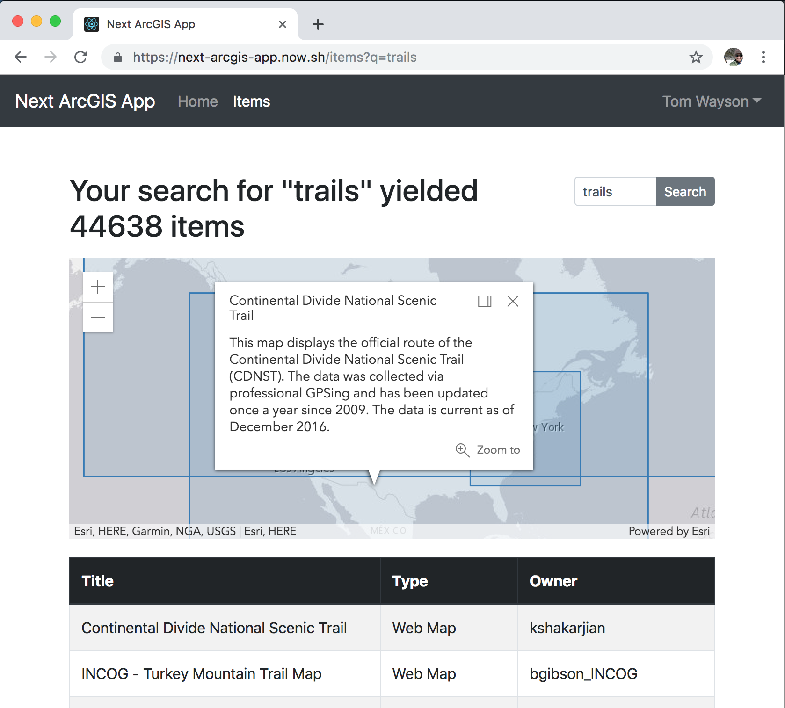

<!-- .slide: data-background="../common/slides/intro.jpg" -->
<!-- .slide: class="title" -->

<h1 style="text-align: left; font-size: 80px;">ArcGIS API for JavaScript</h1>
<h2 style="text-align: left; font-size: 60px;">Using Webpack and React</h2>
<p style="text-align: left; font-size: 30px;">Tom Wayson, Rene Rubalcava</p>
    <p style="text-align: left; font-size: 30px;">slides: <a href="https://git.io/JvVmR" target="_blank">https://git.io/JvVmR</a></p>

<!--
Learn to build powerful applications that integrate the ArcGIS API for JavaScript via the ArcGIS webpack plugin or esri-loader. In this session, we’ll use React to build a fast and responsive application that uses modern tooling and techniques.
-->

----

## ArcGIS API Framework Guides

<a href="https://developers.arcgis.com/javascript/latest/guide/using-frameworks/"></a>

----
<!-- .slide: data-background="./../common/slides/section.jpg" -->

## React

<p><code>ui = f(s)</code></p>

----
<!-- .slide: data-background="./../common/slides/background.jpg" -->

## ArcGIS API for JavaScript

`🌎 = new F(id, container)`

----

## ArcGIS API

1. <!-- .element: class="fragment" --> `Map`
  - `basemap`, `portalItem`, ...
1. <!-- .element: class="fragment" --> `View`
  - `map`
  - `container`
  - ...

----

## React

1. <!-- .element: class="fragment" --> global state
  - store
1. <!-- .element: class="fragment" --> `<Provider store={store}>`
  - <!-- .element: style="list-style: none" -->  `<Router>`
    - <!-- .element: style="list-style: none" --> `<App>`
      - <!-- .element: style="list-style: none" --> `<Layout>`
1. <!-- .element: class="fragment" --> Virtual DOM -> DOM

----

## Component as bridge

<div style="display: flex; flex-direction: row; justify-content: space-between">
  <div>
    <p><strong>React</strong></p>
    <ul style="list-style: none;">
      <li>`<App>`</li>
      <li>&nbsp;&nbsp;`<Layout>`</li>
      <li>&nbsp;&nbsp;&nbsp;&nbsp;`<Parent>`</li>
    </ul>
  </div>
  <div>
    <p style="margin-bottom: 0; margin-top: 8em; font-size: .7em" class="fragment" data-fragment-index="1">props -> state -> render -> ref -></p>
    <p style="margin: 0">`<MapComponent />`</p>
    <p style="margin-top: 0; font-size: .7em" class="fragment" data-fragment-index="3"><- state <- callback <- handler</p>
  </div>
  <div>
    <strong>ArcGIS</strong>
    <div class="fragment" style="font-size: .7em; margin-top: 7em;" data-fragment-index="2">
      <div>`new Map(properties)`</div>
      <div>`new MapView`</div>
      <div>`({ container, map })`</div>
    </div>
  </div>
</div>

----

### Use a [ref](https://reactjs.org/docs/refs-and-the-dom.html) for the `container`

```js
  constructor(props) {
    super(props);
    this.mapRef = React.createRef();
  }

  render() {
    return (
      <div className="webmap" ref={this.mapRef} />
    );
  }
```

----

### Create `Map` and `View` in [`componentDidMount()`](https://reactjs.org/docs/react-component.html#componentdidmount)

```js
  componentDidMount() {
    const map = new ArcGISMap({
      basemap: 'topo-vector'
    });
    this.view = new MapView({
      container: this.mapRef.current,
      map: map,
      center: [-118, 34],
      zoom: 8
    });
  }
```

----

### Clean up in [`componentWillUnmount()`](https://reactjs.org/docs/react-component.html#componentwillunmount)

```js
  componentWillUnmount() {
    if (this.view) {
      // destroy the map view
      this.view.container = null;
    }
  }
```

----

### Function Components

`const NameTag = (props) => { <p>{props.name}</p> }`

`<NameTag name="Tom" />`

<ul class="fragment">
  <li>no way to create refs
  <li>no access to lifecycle methods
  <li>no state
</ul>

----

### What the hook?

Write function components that _use_:
- refs
- lifecycle methods
- state

----

### React hooks

* `useRef`
* `useEffect`
* `useState`

and [more](https://reactjs.org/docs/hooks-intro.html)!

----

<!-- .slide: data-background="../common/slides/background.jpg" class="code-md" data-transition="fade"-->

### `useRef` for the `container`

```jsx
import React, { useRef, useEffect } from 'react';

export const WebMapView = () => {
  const mapRef = useRef();

  return <div className="webmap" ref={mapRef} />;
};
```

----

### `useEffect`

Replaces some class lifecycle methods... mostly
* `componentDidMount`
* `componentDidUpdate`
* `componentWillUnmount`

----

### `useEffect` to create map and view

```jsx
  const mapRef = useRef();
  useEffect(
    () => {
      // create map and view
      const map = new ArcGISMap({
        basemap: 'topo-vector'
      });
      const mapView = new MapView({
        container: mapRef.current,
        map: map,
        center: [-118, 34],
        zoom: 8
      });
      return () => {
        // destroy the map view
        mapView && mapView.container = null;
      };
    }
  , []); // componentDidMount & componentWillUnmount
```

... and clean up

----

<!-- .slide: data-background="../common/slides/background.jpg" class="code-md" data-transition="fade"-->

### `useState`

Manage local state

```ts
const [ready, setReady] = useState(false);
// later, maybe after map loads
setReady(true);
```

----

<!-- .slide: data-background="../common/slides/background.jpg" class="code-md" data-transition="fade"-->

### "Bind" view/map properties to props/state

Hold onto view in state

```ts
const [view, setView] = useState(null);
// later in useEffect()
setView(mapView);
```

----

<!-- .slide: class="code-md" data-transition="fade"-->
### "Bind" view/map properties to props/state

Then use another effect to relay changes in props/state

```jsx
  useEffect(() => {
    if (!view) {
      return;
    }
    view.zoom = zoom;
  }, [view, zoom]); // componentDidUpdate
```

----

<!-- .slide: data-background="../common/slides/section.jpg" class="code-md" data-transition="fade"-->

### 🎉 Success! 🎉

<p>✅ created a map using a `ref` to React generated DOM</p>
<p>✅ only destroy `MapView` when unmounting</p>
<p>✅ relay changes in `props` (or `state`) to map/view</p>
<p class="fragment">🤔 Relay changes or events from map/view to React?</p>

----

<!-- .slide: data-background="../common/slides/section.jpg" class="code-md" data-transition="fade"-->
### Use another effect to wire up a callback

```jsx
  useEffect(() => {
    if (!view) {
      return;
    }
    const handle = view.on('click', callback);
    return function removeHandle() {
      handle.remove();
    };
  }, [view, callback]); // componentDidUpdate
```

use clean-up functions to remove event & watch handlers

----

<!-- .slide: data-background="../common/slides/background.jpg" -->

### Component is key to integration

<small>... class-based or hooks 🙂</small>

<ul style="list-style: none">
  <li>✅ acts as a bridge between React and ArcGIS</li>
  <li>✅ use a `ref` to get the view's `container`</li>
  <li>✅ send React `props` & `state` to map & view properties</li>
  <li>✅ send changes and events from ArcGIS to React via callbacks</li>
</li>

----

### [Using the ArcGIS API for JavaScript with React](https://developers.arcgis.com/javascript/latest/guide/react)

<iframe src="https://developers.arcgis.com/javascript/latest/guide/react/" style="width: 600px; height:  600px"></iframe>

----

<!-- .slide: data-background="../common/slides/section.jpg" -->
## Modern React and the ArcGIS API

----

### Manage global state in React

* You may not need Redux/MobX
* Context is powerful, and injectable

----

<!-- .slide: data-background="../common/slides/section.jpg" -->

### `useContext` hook

```jsx
import ThemeContext from '.ThemeContext';

const ThemedMap = () => {
  const theme = useContext(ThemeContext);
  const basemap = theme === 'dark'
    ? 'dark-gray'
    : 'gray';
  return (
    <Map basemap={basemap} />
  );
};
```

----

<!-- .slide: data-background="../common/slides/section.jpg" -->

## Modularize API usage

----

* Do all the API work separate from your UI
* _Separate content from navigation_ - pattern in PWAs
* Mock/stub API in tests

```ts
// src/data/map.ts
export function initialize(element: Element) {
  view.container = element;
  view.when(() => {
    // magic
  });
}
```

----

* Use in your context or component

```ts
const elRef = useRef(null);
useEffect(
  () => {
    const loadMap = async (container) => {
      const map = await import("../data/map");
      map.initialize(elRef.current);
    };
    loadMap();
  },
  []
);
```

----

<!-- .slide: data-background="../common/slides/section.jpg" -->

## Why lazy load the API?

* So webpack can create async bundles
* `bundle1.js` -> `bundle2.js` -> `bundle3.js`
* Only load the resources you need when you need them
* Leads to faster initial loads

----

<!-- .slide: data-background="../common/slides/background.jpg" -->

## Suspense

----

## Hold your Suspense

* Lazy-load entire React components
* useful in modular apps

```tsx
import React, { lazy, Suspense } from "react";
// lazy load the components that use Maps
const WebMapView = lazy(() => import("../components/WebMapView"));
// later on
<Suspense  fallback={<div>Loading...</div>}>
  <WebMapView />
</Suspense>
```

----

<!-- .slide: data-background="../common/slides/demo.jpg" -->

##  Example: [Nearby JavaScript](https://developers.arcgis.com/example-apps/nearby-javascript/)


----

<!-- .slide: data-background="../common/slides/section.jpg" data-transition="fade" -->

## 😎 [@arcgis/webpack-plugin](https://github.com/Esri/arcgis-webpack-plugin) 👍
<p>... but</p>
<p class="fragment">Must be using webpack 🙄</p>
<p class="fragment">ArcGIS API 4.7+ only</p>
<p class="fragment">Must be able to configure webpack</p>

----

<!-- .slide: data-background="../common/slides/demo.jpg" data-transition="fade" -->

## Popular React Tools & Frameworks

<table class="clis">
  <tbody>
    <tr>
      <td>
        <a href="https://github.com/facebook/create-react-app">
          
          <p>create-react-app</p>
        </a>
      </td>
      <td>
        <a href="https://nextjs.org/">
          
          <p>Next.js</p>
        </a>
      </td>
      <td>
        <a href="https://www.gatsbyjs.org/">
          
          <p>Gatsby</p>
        </a>
      </td>
    </tr>
  </tbody>
</table>
<p class="fragment">All insulate you from 😱 of webpack config</p>

----

<!-- .slide: data-transition="fade" -->
<p>👵 ArcGIS API 3.x? 👴</p>
<p>🚀 CLI blocks access to webpack config? 🔒</p>
<p>🙈 Don't _want_ to config webpack? 😱</p>
<div class="fragment">
  <p>No problem. Try [esri-loader](https://github.com/Esri/esri-loader)</p>
  
</div>

----

<!-- .slide: data-transition="fade" -->
### Works with ArcGIS API [3.x](https://developers.arcgis.com/javascript/3/) <span class="fragment" data-fragment-index="1">_and_ 4.x</span>

<div>
  
  
  
  
</div>

----

<!-- .slide: data-background="../common/slides/background.jpg" class="code-md" data-transition="fade" -->
### Works with _any_ React tool / library / framework

<div>
  
  
  
  
  
  
</div>

----

<!-- .slide: data-background="../common/slides/background.jpg" class="code-md" data-transition="fade" -->
### BTW... <span class="fragment" data-fragment-index="1">Not _just_ for Webpack & React</span>

<div class="fragment" data-fragment-index="1">
  
  
</div>

----

<!-- .slide: data-background="../common/slides/background.jpg" class="code-md" data-transition="fade" -->
### Works with _any_ module loader

<div>
  
  
  
  
  
</div>

----

<!-- .slide: data-background="../common/slides/background.jpg" class="code-md" data-transition="fade" -->
### Works with _any_ framework

<div>
  
  
  
  
  
  
  
</div>

----

<!-- .slide: data-background="../common/slides/background.jpg" class="code-md" data-transition="fade" -->
### Installing [esri-loader](https://github.com/Esri/esri-loader#install)


<h3><code>npm install --save esri-loader</code></h3>

----

<!-- .slide: data-background="../common/slides/background.jpg" class="code-md" data-transition="fade" -->
### Installing [esri-loader](https://github.com/Esri/esri-loader#install)


<h3><code>yarn add esri-loader</code></h3>

----

<!-- .slide: data-background="../common/slides/background.jpg" class="code-md" data-transition="fade" -->
### Using [`loadModules()`](https://github.com/Esri/esri-loader#usage)

```js
import { loadModules } from 'esri-loader';

loadModules([
  "esri/Map",
  "esri/views/MapView"
]).then(([Map, MapView]) => {
  // Code to create the map and view will go here
});
```

----

<!-- .slide: data-background="../common/slides/background.jpg" class="code-md" data-transition="fade" -->
### Look [familiar](https://developers.arcgis.com/javascript/latest/sample-code/intro-mapview/index.html)?

```js
// this is what loadModules() does under the hood

require([
  "esri/Map",
  "esri/views/MapView"
], function(Map, MapView) {
  // Code to create the map and view will go here
});
```

----

<!-- .slide: data-background="../common/slides/background.jpg" class="code-md" data-transition="fade" -->
### [Lazy loads the ArcGIS API](https://github.com/Esri/esri-loader#lazy-loading-the-arcgis-api-for-javascript) by default

```js
 // loads API 1st time
const esriConfig = await loadModules(["esri/config"])
esriConfig.useIdentity = false;
// don't worry, this won't load the API again!
const [Map, MapView] = await loadModules(
  ["esri/Map", "esri/views/MapView"]
);
```

----

<!-- .slide: data-background="../common/slides/background.jpg" class="code-md" data-transition="fade" -->
### Additional options & patterns

See the esri-loader docs for examples of:
- [Using a specific version of the ArcGIS API](https://github.com/Esri/esri-loader#from-a-specific-version)
- [configuring Dojo](https://github.com/Esri/esri-loader#configuring-dojo)
- [using ArcGIS types in TS](https://github.com/Esri/esri-loader#arcgis-types)
- and [more](https://github.com/Esri/esri-loader#advanced-usage)

----

<!-- .slide: data-background="../common/slides/demo.jpg" data-transition="fade" -->

### [esri-loader-hooks](https://github.com/tomwayson/esri-loader-hooks#usewebmap)

```jsx
import React from 'react';
import { useWebMap } from 'esri-loader-hooks';

function WebMap() {
  const [ref] = useWebMap('e691172598f04ea8881cd2a4adaa45ba');
  return <div style={{ height: 400 }} ref={ref} />;
}
```

----

### Example: [esri-loader-hooks](https://esri-loader-hooks.netlify.com/)

<a href="https://esri-loader-hooks.netlify.com/"></a>

----

<!-- .slide: data-background="../common/slides/demo.jpg" data-transition="fade" -->

## Example: Create ArcGIS App

<a href="https://create-arcgis-app.surge.sh/"></a>

[create-arcgis-app](https://github.com/tomwayson/create-arcgis-app)

----

<!-- .slide: data-background="../common/slides/demo.jpg" data-transition="fade" -->

## Example: Next ArcGIS App

<a href="https://next-arcgis-app.now.sh/"></a>

[next-arcgis-app](https://github.com/tomwayson/next-arcgis-app)

----

<!-- .slide: data-background="../common/slides/demo.jpg" data-transition="fade" -->

## Conclusion

<div>
  
  
  
  
</div>

Note:
It's never been a better time to be a React dev
It's never been a better time to be a ArcGIS dev
Go forth and prosper

----


